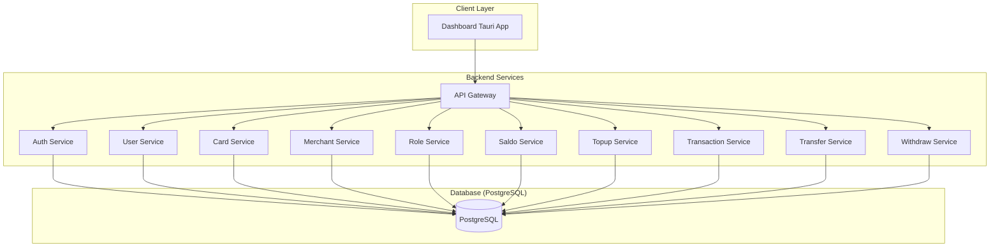
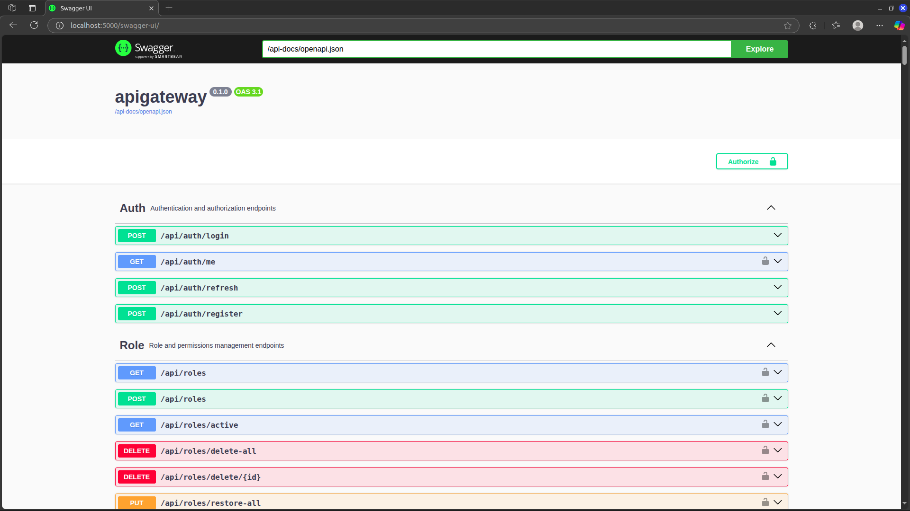
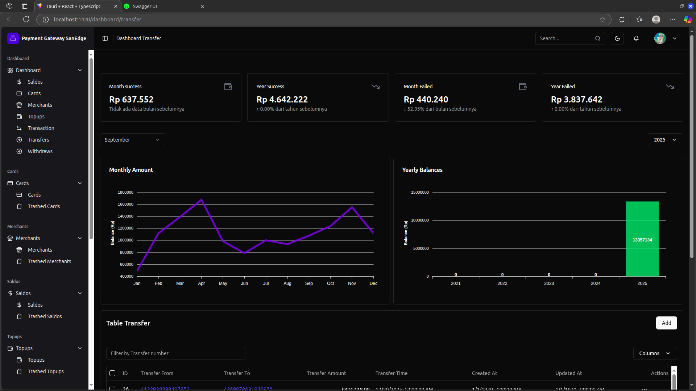

## Example Sqlx Payment Gateway

## Design Archicture

```mermaid
graph TD
    %% Client Layer
    subgraph "Client Layer"
        D[Dashboard Tauri App]
    end

    %% Backend Layer
    subgraph "Backend Services"
        A[API Gateway]
        S1[Auth Service]
        S2[User Service]
        S3[Card Service]
        S4[Merchant Service]
        S5[Role Service]
        S6[Saldo Service]
        S7[Topup Service]
        S8[Transaction Service]
        S9[Transfer Service]
        S10[Withdraw Service]
    end

    %% Database Layer
    subgraph "Database (PostgreSQL)"
        DB[(PostgreSQL)]
    end

    %% Connections
    D --> A
    A --> S1
    A --> S2
    A --> S3
    A --> S4
    A --> S5
    A --> S6
    A --> S7
    A --> S8
    A --> S9
    A --> S10

    S1 --> DB
    S2 --> DB
    S3 --> DB
    S4 --> DB
    S5 --> DB
    S6 --> DB
    S7 --> DB
    S8 --> DB
    S9 --> DB
    S10 --> DB

```

### Screenshot

#### OpenApi

#### Dashboard Tauri

