# Example Payment Gateway (Modular Monolith)


This project is an example implementation of a **payment gateway system** built with Rust, featuring a **modular monolith** architecture. It simulates a complete digital financial transaction process, including user management, digital wallets, and various transaction types (top-up, transfer, withdrawal).

The primary goal is to provide a comprehensive, real-world reference for building robust, scalable, and observable systems using Rust's modern ecosystem.

## Features

-   ✅ **JWT Authentication** with refresh tokens
-   ✅ **Role-Based Access Control (RBAC)**
-   ✅ **Digital Wallet Management**
-   ✅ **Complete Transaction Lifecycle** (Top-up, Transfer, Withdraw, Payment)
-   ✅ **Payment Card Management**
-   ✅ **Merchant API Key Management**
-   ✅ **Comprehensive Observability** with metrics, logging, and distributed tracing
-   ✅ **Containerized Deployment** with Docker and Kubernetes
-   ✅ **API Documentation** with Swagger UI

## Architecture

The system uses a modular monolith architecture where an **API Gateway** serves as the single entry point. Each business domain is separated into an independent Rust crate (module), and all inter-module communication is handled via gRPC for high performance and type safety.

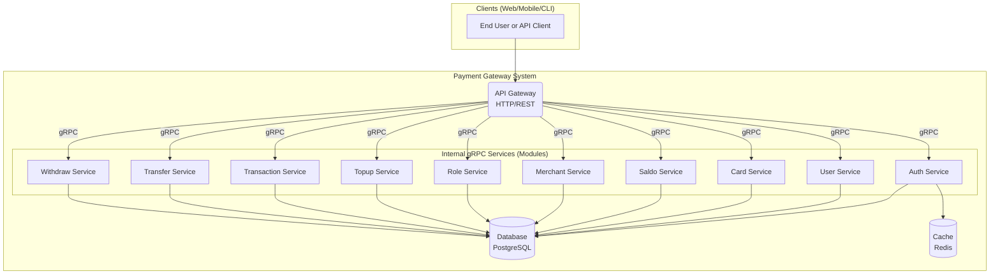

## Technology Stack

| Category              | Technology                                                                                              |
| --------------------- | ------------------------------------------------------------------------------------------------------- |
| **Language**          | Rust (Stable)                                                                                           |
| **Async Runtime**     | `tokio`                                                                                                 |
| **Web Framework**     | `axum` (for API Gateway)                                                                                |
| **Inter-service**     | `tonic` (gRPC), `prost` (Protobuf)                                                                      |
| **Database**          | PostgreSQL                                                                                              |
| **ORM / DB Driver**   | `sqlx`                                                                                                  |
| **Cache**             | Redis                                                                                                   |
| **Containerization**  | Docker, Docker Compose                                                                                  |
| **Orchestration**     | Kubernetes (Minikube for local setup)                                                                   |
| **Observability**     | **OpenTelemetry**, **Prometheus** (metrics), **Grafana** (dashboards), **Jaeger** (tracing), **Loki** (logs) |                                                                        

## Getting Started

### Prerequisites

-   [Docker](https://docs.docker.com/get-docker/) and [Docker Compose](https://docs.docker.com/compose/install/)
-   [`sqlx-cli`](https://github.com/launchbadge/sqlx/tree/main/sqlx-cli) for database migrations.
-   (Optional, for K8s) [Minikube](https://minikube.sigs.k8s.io/docs/start/) and [kubectl](https://kubernetes.io/docs/tasks/tools/).

---

### Option 1: Run with Docker Compose (Recommended)

This is the fastest way to get the entire system running on your local machine.

1.  **Clone the Repository**

    ```bash
    git clone https://github.com/MamangRust/example-payment-gateway-sqlx.git
    cd example-payment-gateway-sqlx/backend
    ```

2.  **Configure Environment**

    Review the `.env` file and ensure the settings (especially `DATABASE_URL`) match the configuration in `docker-compose.yml`. The defaults should work out of the box.

3.  **Run the Database Migration**

    Before starting the services, you need to set up the database schema.
    
    First, start the database container:
    ```bash
    docker-compose up -d db
    ```
    
    Wait a few seconds for it to initialize, then run the migrations:
    ```bash
    # Ensure your .env file is present in the current directory
    sqlx migrate run
    ```

4.  **Start All Services**

    Now, bring up the entire stack, including all application services and the observability suite.

    ```bash
    docker-compose up -d
    ```

    The application services use pre-built images from `ghcr.io`. If you want to use your local code changes, you must first build the images using the `./build-docker-images.sh` script.

5.  **Access the System**
    -   **API Gateway / Swagger UI**: `http://localhost:5000/swagger-ui/`
    -   See the **Observability** section below for more URLs.

---

### Option 2: Deploy to Kubernetes (Minikube)

This method simulates a production-like deployment on a local Kubernetes cluster.

1.  **Clone the Repository**

    ```bash
    git clone https://github.com/MamangRust/example-payment-gateway-sqlx.git
    cd example-payment-gateway-sqlx/backend
    ```

2.  **Build Local Docker Images**

    The Kubernetes manifests are configured to use local images. Run the build script to create them.

    ```bash
    ./build-docker-images.sh
    ```

3.  **Run the Minikube Setup Script**

    This script will:
    -   Start Minikube (if not already running).
    -   Load the necessary Docker images into Minikube's context.
    -   Apply all Kubernetes manifests for databases, observability, and application services.

    ```bash
    ./k8s/scripts/setup-minikube.sh
    ```

4.  **Access the System**

    The script will output all the access URLs. The application will be available via a NodePort on your Minikube IP. Example:

    -   **Main Application**: `http://<MINIKUBE_IP>:30080`
    -   **Grafana**: `http://<MINIKUBE_IP>:30030`
    -   **Jaeger**: `http://<MINIKUBE_IP>:31686`

## Observability Stack

The `docker-compose` and `minikube` setups include a full observability stack. Here’s how to access the different tools when running with **Docker Compose**:

| Service        | URL                             | Description                                            |
| -------------- | ------------------------------- | ------------------------------------------------------ |
| **Grafana**    | `http://localhost:3000`         | Dashboards for metrics and logs. (Login: admin/admin)  |
| **Prometheus** | `http://localhost:9090`         | Time-series database for metrics.                      |
| **Jaeger**     | `http://localhost:16686`        | Distributed tracing UI.                                |
| **Loki**       | `http://localhost:3100`         | Log aggregation system.                                |
| **Alertmanager**| `http://localhost:9093`        | Manages alerts sent by Prometheus.                     |

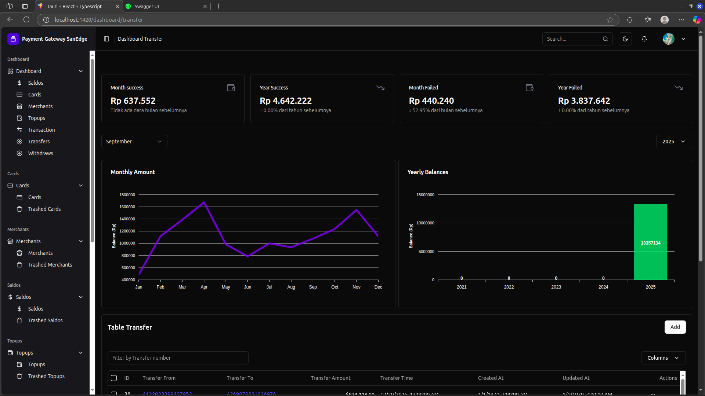

## API Documentation

The API Gateway provides OpenAPI documentation via Swagger UI. Once the system is running, you can access it at:

-   `http://localhost:5000/swagger-ui/`

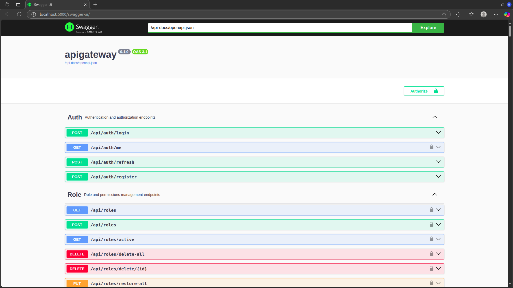

## Project Structure

-   `crates/`: Contains all the independent Rust modules (services).
    -   `apigateway`: The public-facing REST API gateway.
    -   `auth`, `user`, `card`, etc.: Internal services, each representing a business domain.
    -   `genproto`: Crate for compiling `.proto` files into Rust code for gRPC.
-   `proto/`: Protobuf definition files.
-   `migrations/`: SQLx database migrations.
-   `docker-compose.yml`: Defines the local development environment.
-   `k8s/`: Contains all Kubernetes manifests for deployment.
-   `observability/`: Configuration files for Prometheus, Grafana, Loki, etc.

<details>
<summary><b>Manual Installation (Without Containers)</b></summary>

### Prerequisites

-   [Rust & Cargo](https://www.rust-lang.org/tools/install)
-   [`sqlx-cli`](https://github.com/launchbadge/sqlx/tree/main/sqlx-cli)
-   [`protoc`](https://grpc.io/docs/protoc-installation/)
-   A running PostgreSQL instance.

### Installation Steps

1.  **Clone Repository**

    ```bash
    git clone https://github.com/MamangRust/example-payment-gateway-sqlx.git
    cd example-payment-gateway-sqlx/backend
    ```

2.  **Setup Environment**
    Create and edit an `.env` file with your database configuration.

3.  **Database Migration**

    ```bash
    sqlx migrate run
    ```

4.  **Build Protobuf**

    ```bash
    cargo build -p genproto
    ```

5.  **Build All Services**
    ```bash
    cargo build --workspace
    ```

### Running the Application

You need to run each service in a separate terminal.

```bash
# Terminal 1: API Gateway
cargo run -p apigateway

# Terminal 2: Auth Service
cargo run -p auth

# ... and so on for every other service in the `crates` directory.
```

</details>


## Preview

**Jaeger UI**
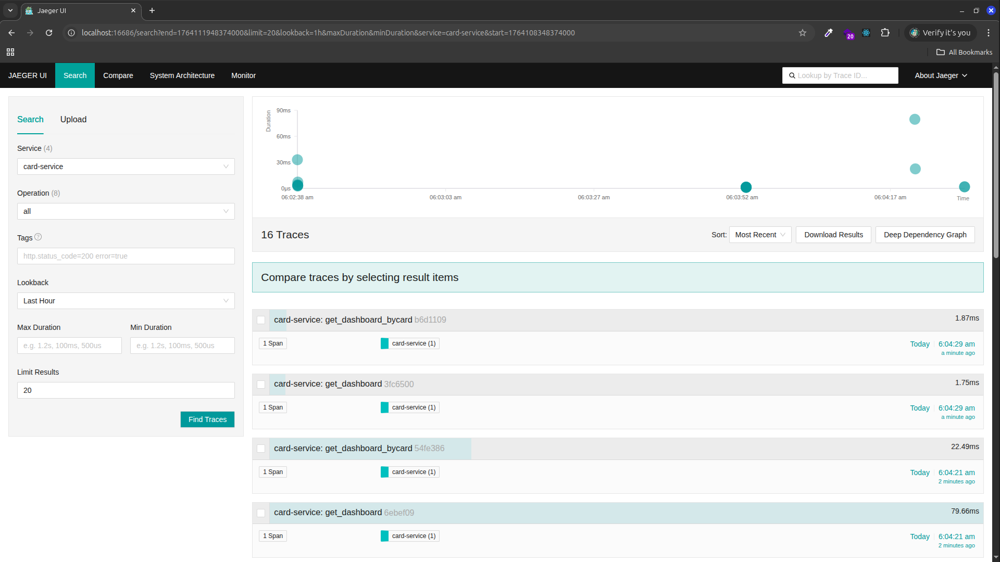

**Node Exporter**
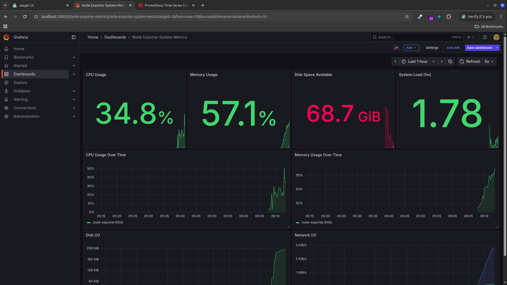

**Monitoring Memory**


**Monitoring Card Service**


**Monitoring Merchant Service**
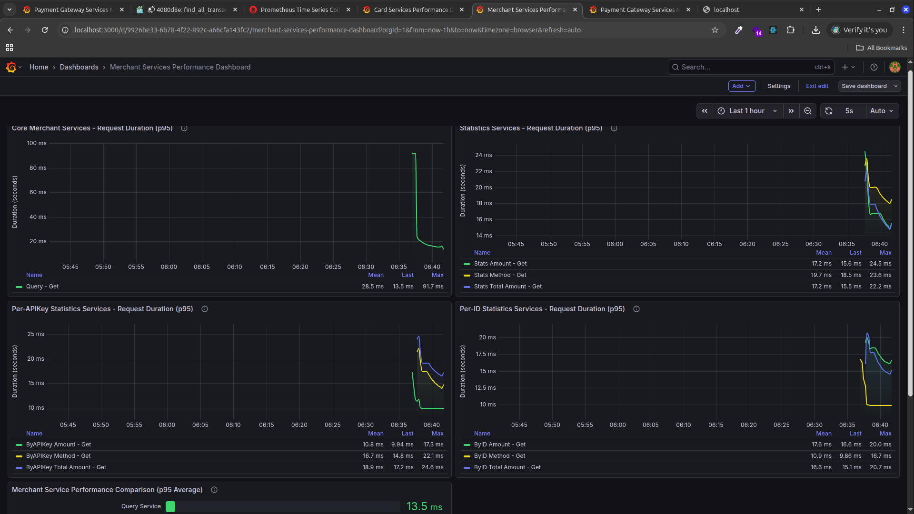

**Monitoring User Service**
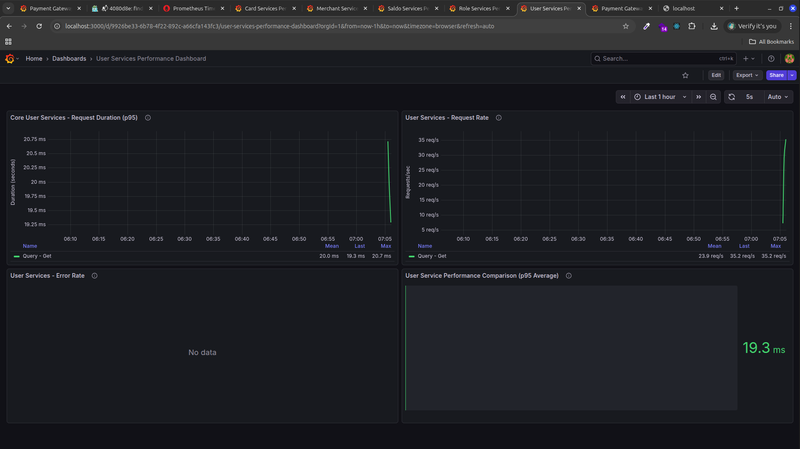

**Monitoring Role Service**
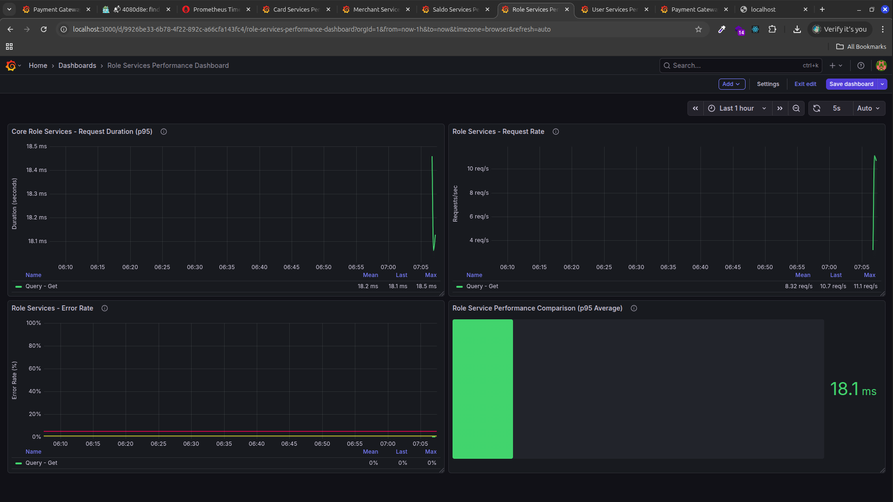

**Monitoring Saldo Service**
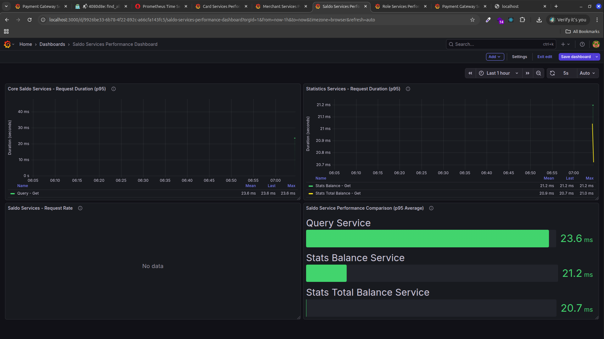

**Monitoring Topup Service**
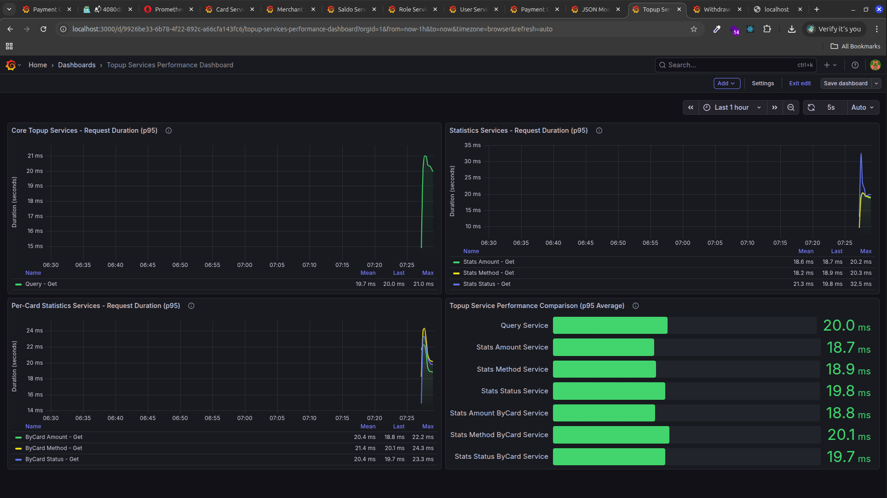

**Monitoring Transaction Service**
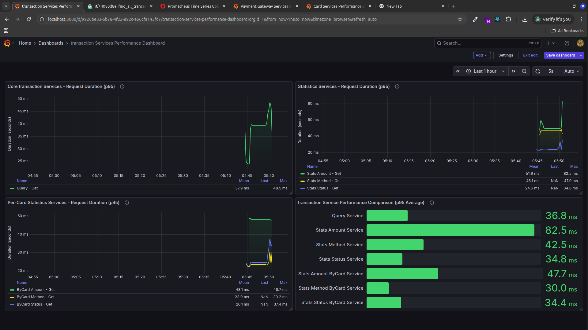

**Monitoring Transfer Service**


**Monitoring Withdraw Service**

