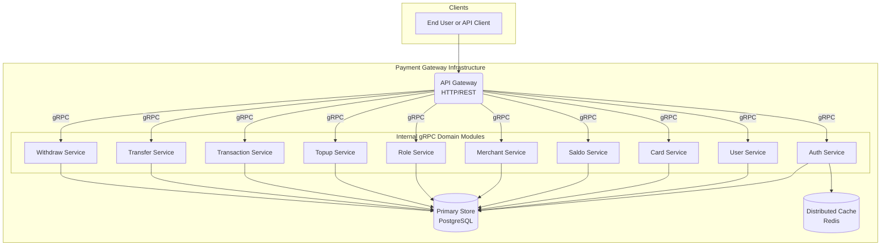
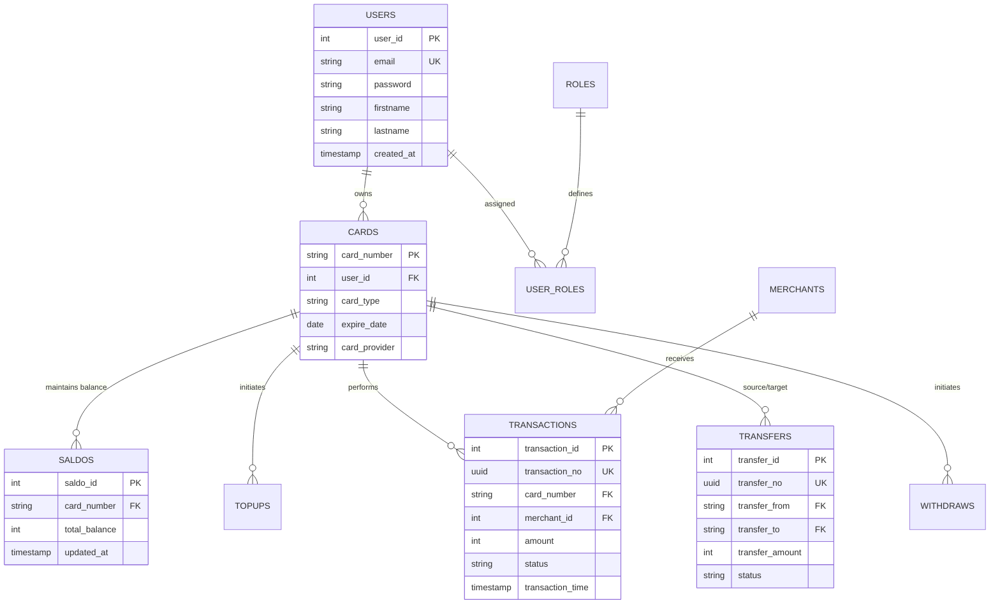
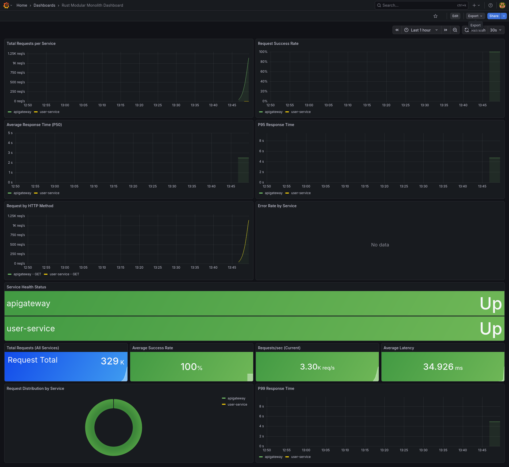
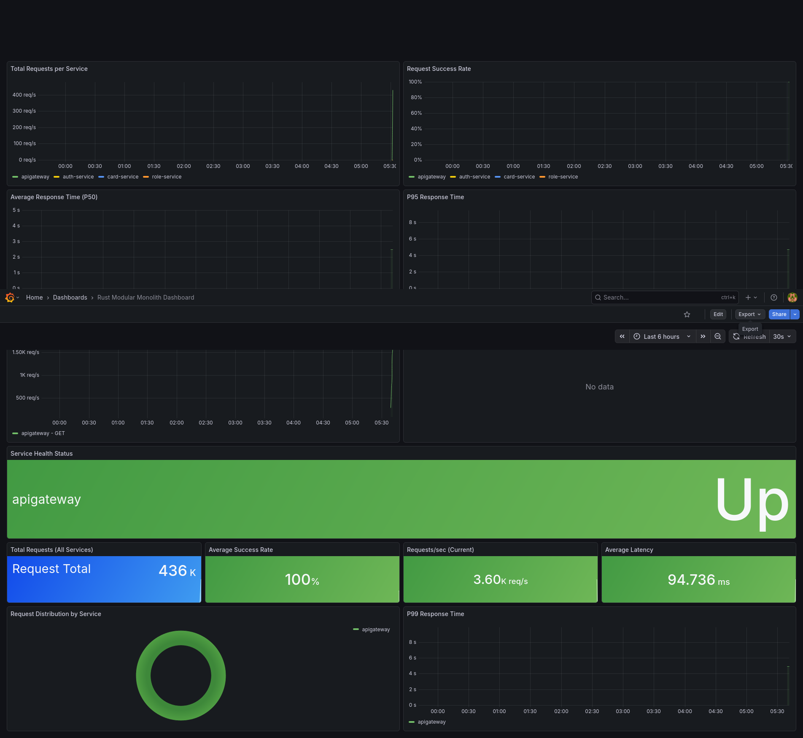
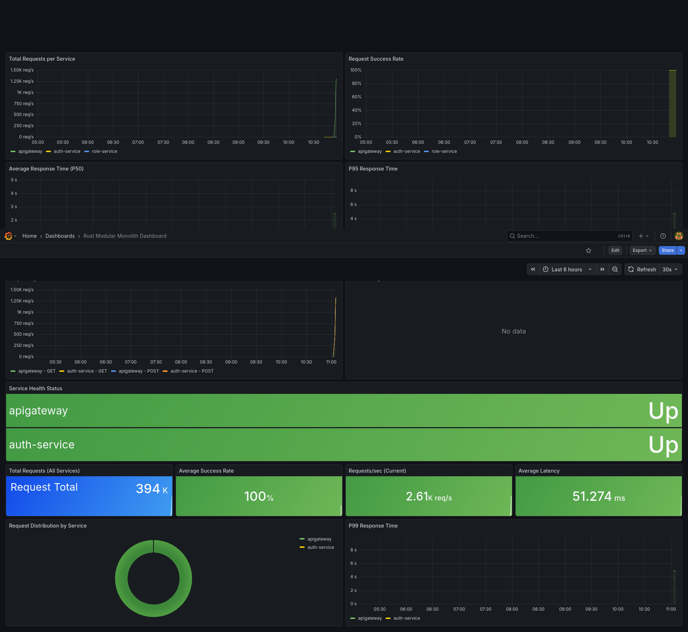

# Payment Gateway Reference Implementation (Modular Monolith)


This repository features a production-grade implementation of a payment gateway system architectural pattern. Built with Rust, it demonstrates a modular monolith design, providing a scalable and highly observable foundation for digital financial services. The system simulates a comprehensive transaction ecosystem, including identity management, secure digital wallets, and automated transaction processing.

The primary objective of this project is to showcase advanced backend engineering practices using the modern Rust ecosystem, emphasizing performance, type safety, and robust system observability.

## Table of Contents

- [Overview](#overview)
- [Core Features](#core-features)
- [System Architecture](#system-architecture)
- [Database Schema (ERD)](#database-schema-erd)
- [Technology Stack](#technology-stack)
- [Performance and Scalability](#performance-and-scalability)
- [Getting Started](#getting-started)
  - [Prerequisites](#prerequisites)
  - [Option 1: Docker Compose Deployment](#option-1-docker-compose-deployment)
  - [Option 2: Kubernetes Deployment](#option-2-kubernetes-deployment)
  - [Manual Installation](#manual-installation)
- [Observability Suite](#observability-suite)
- [API Documentation](#api-documentation)
- [Project Layout](#project-layout)
- [Development Guide](#development-guide)
- [Monitoring and Visualizations](#monitoring-and-visualizations)

---

## Overview

The Payment Gateway Reference Implementation addresses the complexities of modern financial systems by providing a stable, modular, and observable architecture. Key design pillars include:

- **Identity and Access Management:** Formal JWT-based authentication featuring refresh token rotation and hierarchical Role-Based Access Control (RBAC).
- **Fiscal Integrity:** Atomic wallet operations ensuring consistency across all balance updates and historical records.
- **Transaction Engine:** Orchestrated processing for Diverse transaction types, including top-ups, peer-to-peer transfers, and merchant settlements.
- **Enterprise Integration:** Merchant lifecycle management including secure API key issuance and validation.
- **Advanced Observability:** Native instrumentation for distributed tracing, metrics aggregation, and structured logging.

The system maintains domain isolation through independent Rust crates communicating via high-performance gRPC, strike a balance between developmental agility and future microservice readiness.

## Core Features

- **JWT Identity Management** with formal refresh token rotation logic.
- **Granular Access Control (RBAC)** for enterprise-level security.
- **Digital Wallet Management** with real-time balance reconciliation.
- **Full Transaction Lifecycle** supporting Top-ups, Transfers, Withdrawals, and Payments.
- **Card Vault Architecture** for secure management of payment instruments.
- **Merchant Ecosystem** featuring secure API key management for third-party integrations.
- **Standardized Observability** utilizing OpenTelemetry, Prometheus, Jaeger, and Loki.
- **Deployment-Ready Configurations** optimized for Docker Compose and Kubernetes.

## System Architecture

The solution adheres to a modular monolith pattern. An API Gateway serves as the centralized entry point, proxying external RESTful requests to domain-isolated internal services via gRPC. This design ensures high throughput and strong interface contracts between modules.


```mermaid
graph TD
    subgraph "Clients"
        A[End User or API Client]
    end

    subgraph "Payment Gateway Infrastructure"
        B(API Gateway <br> HTTP/REST)

        subgraph "Internal gRPC Domain Modules"
            C[Auth Service]
            D[User Service]
            E[Card Service]
            F[Saldo Service]
            G[Merchant Service]
            H[Role Service]
            I[Topup Service]
            J[Transaction Service]
            K[Transfer Service]
            L[Withdraw Service]
        end

        M[(Primary Store <br> PostgreSQL)]
        N[(Distributed Cache <br> Redis)]
    end

    A --> B

    B -- gRPC --> C
    B -- gRPC --> D
    B -- gRPC --> E
    B -- gRPC --> F
    B -- gRPC --> G
    B -- gRPC --> H
    B -- gRPC --> I
    B -- gRPC --> J
    B -- gRPC --> K
    B -- gRPC --> L

    C --> M & N
    D --> M
    E --> M
    F --> M
    G --> M
    H --> M
    I --> M
    J --> M
    K --> M
    L --> M
```

## Database Schema (ERD)

The following Entity Relationship Diagram illustrates the architectural design of the database. The schema is optimized for data integrity and comprehensive auditability in high-frequency financial environments.


```mermaid
erDiagram
    USERS ||--o{ CARDS : "owns"
    USERS ||--o{ USER_ROLES : "assigned"
    ROLES ||--o{ USER_ROLES : "defines"
    CARDS ||--o{ SALDOS : "maintains balance"
    CARDS ||--o{ TOPUPS : "initiates"
    CARDS ||--o{ TRANSACTIONS : "performs"
    CARDS ||--o{ TRANSFERS : "source/target"
    CARDS ||--o{ WITHDRAWS : "initiates"
    MERCHANTS ||--o{ TRANSACTIONS : "receives"
    
    USERS {
        int user_id PK
        string email UK
        string password
        string firstname
        string lastname
        timestamp created_at
    }
    
    CARDS {
        string card_number PK
        int user_id FK
        string card_type
        date expire_date
        string card_provider
    }
    
    SALDOS {
        int saldo_id PK
        string card_number FK
        int total_balance
        timestamp updated_at
    }
    
    TRANSACTIONS {
        int transaction_id PK
        uuid transaction_no UK
        string card_number FK
        int merchant_id FK
        int amount
        string status
        timestamp transaction_time
    }
    
    TRANSFERS {
        int transfer_id PK
        uuid transfer_no UK
        string transfer_from FK
        string transfer_to FK
        int transfer_amount
        string status
    }
```

## Technology Stack

| Category | Technology |
| :--- | :--- |
| **Language** | Rust (Stable) |
| **Async Runtime** | `tokio` |
| **Service Layer** | `axum` (API Gateway) |
| **Communication** | `tonic` (gRPC), `prost` (Protobuf) |
| **Data Storage** | PostgreSQL |
| **Database Interface**| `sqlx` (Type-safe SQL) |
| **Caching Layer** | Redis |
| **Observability** | **OpenTelemetry**, **Prometheus**, **Jaeger**, **Loki**, **Grafana** |
| **Infrastructure** | Docker, Kubernetes |

---

## Performance and Scalability

The system has undergone extensive load testing to validate its performance under production-grade conditions. The benchmarks emphasize system reliability, backpressure management, and graceful degradation.

### Benchmark Analysis

| Domain Module | Peak Throughput (RPS) | p95 Latency | Observed Behavior |
| :--- | :--- | :--- | :--- |
| **Identity Management** | ~1,900 | 690ms | Stable linear scaling with controlled tail latency. |
| **Security & Access** | ~1,300 | 1.22s | Consistent enforcement of system protection limits. |
| **Core Financials** | ~4,700 (raw) | 619ms | Optimized aggregation for high-frequency reads. |

### Visual Performance Analysis

| User Module Capability | Card Module Load | Role Module Stress |
| :---: | :---: | :---: |
|  |  |  |

---

## Getting Started

### Prerequisites

The following software is required for deployment and development:

- [Docker](https://docs.docker.com/get-docker/) & [Docker Compose](https://docs.docker.com/compose/install/)
- [`sqlx-cli`](https://github.com/launchbadge/sqlx/tree/main/sqlx-cli) for database schema management.
- (Optional) [Minikube](https://minikube.sigs.k8s.io/docs/start/) for local Kubernetes orchestration.

### Option 1: Docker Compose Deployment

1. **Initialization:**
   ```bash
   git clone https://github.com/MamangRust/example-payment-gateway-sqlx.git
   cd example-payment-gateway-sqlx/backend
   ```
2. **Schema Integration:**
   ```bash
   docker-compose up -d db
   # Allow time for database initialization
   sqlx migrate run
   ```
3. **Environment Launch:**
   ```bash
   docker-compose up -d
   ```
4. **Verification:** Access the Swagger UI documentation at `http://localhost:5000/swagger-ui/`.

### Manual Installation

For local build and development, execute services directly via cargo: `cargo run -p <crate_name>`. Ensure that PostgreSQL and Redis services are reachable within the environment.

---

## Observability Suite

| Component | Endpoint | Role |
| :--- | :--- | :--- |
| **Grafana** | `http://localhost:3000` | Unified Visualization (admin/admin) |
| **Prometheus** | `http://localhost:9090` | Metrics Collection |
| **Jaeger** | `http://localhost:16686` | Distributed Tracing Analysis |
| **Loki** | `http://localhost:3100` | Centralized Log Aggregation |

---

## API Documentation

Formal API specifications are exposed via Swagger UI for interactive exploration and testing:
`http://localhost:5000/swagger-ui/`


## Project Layout

```text
backend/
├── crates/             # Domain-specific micro-modules (gateway, auth, user, etc.)
├── proto/              # Standardized gRPC interface definitions
├── migrations/         # Database schema lifecycle management
├── observability/      # Operational configurations (Prometheus, Grafana, Loki)
└── k8s/               # Production-grade Kubernetes manifests
```

## Monitoring and Visualizations

### Distributed Request Tracing (Jaeger)


### Infrastructure Telemetry (Node Exporter)


### Service-Specific Telemetry
**Memory Utilization Profile**


**Digital Wallet Analytics**


**Transaction Processing Overview**


