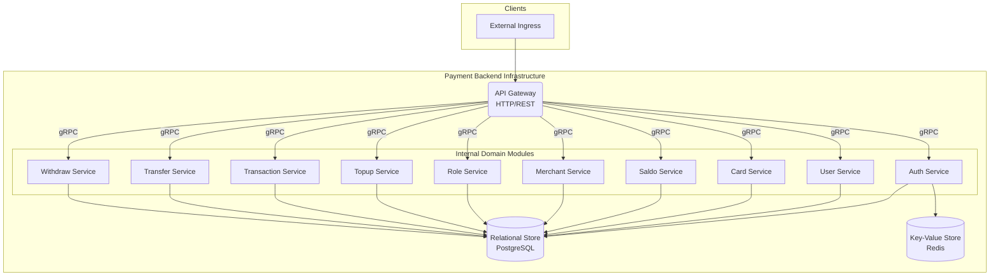
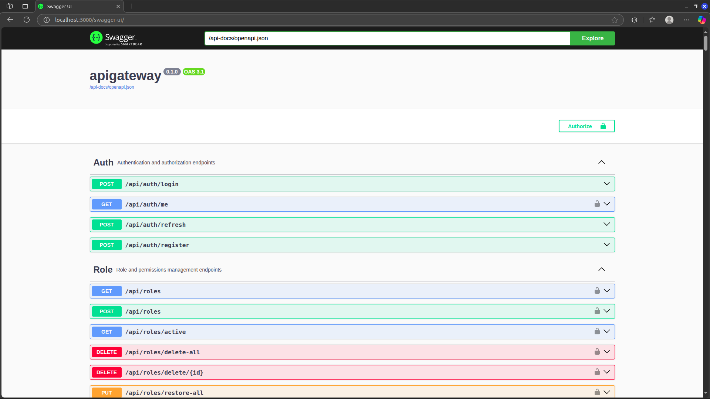
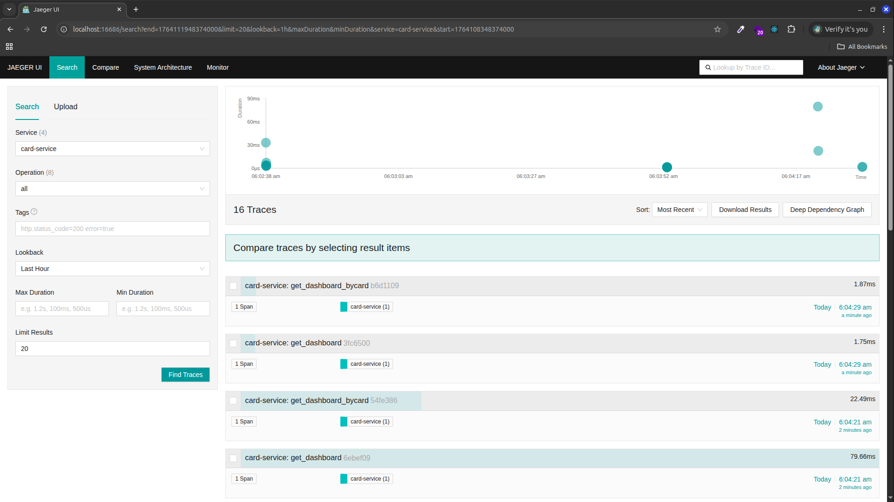
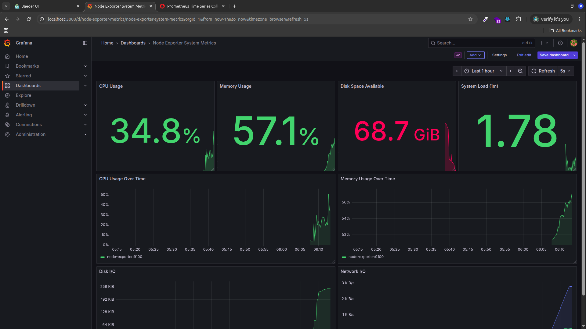
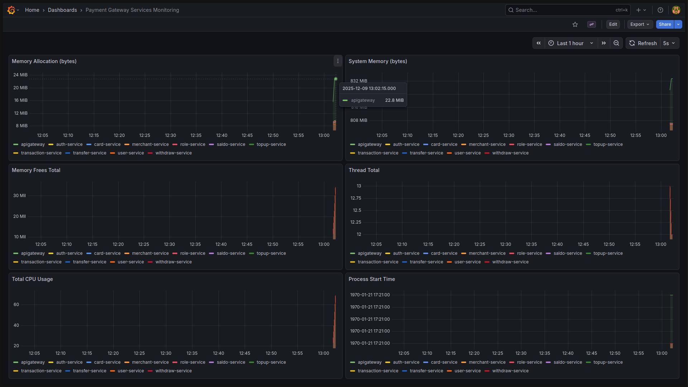
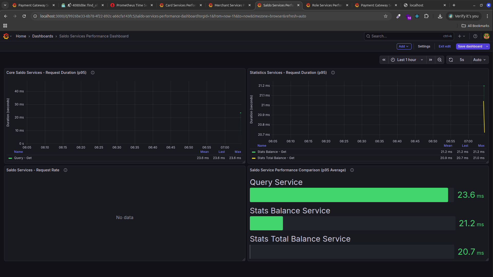
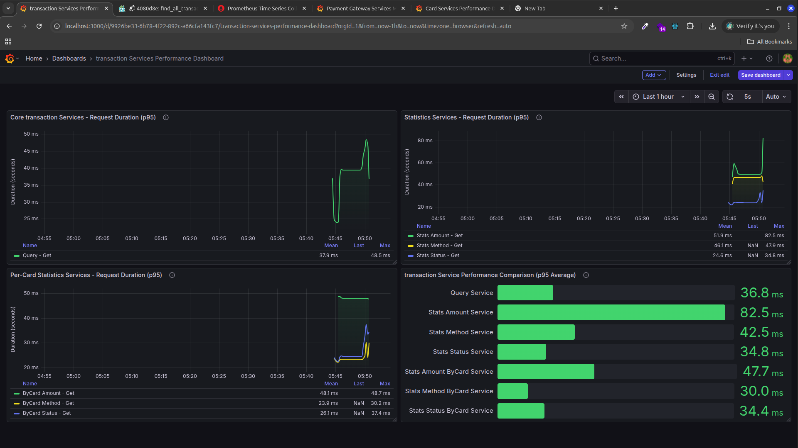

# Payment Gateway Backend Reference


This directory contains the primary backend implementation for the Payment Gateway System. Developed in Rust, the backend utilizes a modular monolith architecture with internal domain services orchestrated via gRPC. This implementation serves as a comprehensive reference for engineering scalable, type-safe, and observable financial systems.

## Table of Contents

- [Overview](#overview)
- [Core Features](#core-features)
- [Service Architecture](#service-architecture)
- [Technology Stack](#technology-stack)
- [Getting Started](#getting-started)
  - [Prerequisites](#prerequisites)
  - [Option 1: Docker Compose Deployment](#option-1-docker-compose-deployment)
  - [Option 2: Kubernetes Deployment](#option-2-kubernetes-deployment)
  - [Option 3: Manual Development Configuration](#option-3-manual-development-configuration)
- [Observability Suite](#observability-suite)
- [API Documentation](#api-documentation)
- [Project Layout](#project-layout)
- [Development Guide](#development-guide)
- [Service Reference](#service-reference)
- [Monitoring and Visualizations](#monitoring-and-visualizations)

---

## Overview

The backend architecture is engineered for high-integrity financial processing. It encompasses user authentication, digital wallet management, payment card processing abstractions, merchant lifecycle management, and a comprehensive suite of transaction services.

By leveraging a modular monolith design, the system enforces strict domain boundaries through encapsulated Rust crates. This methodology provides several architectural advantages:

- **Type Safety:** Strong interface contracts across all service boundaries.
- **Performance:** High-efficiency inter-service communication via gRPC.
- **Maintainability:** Clear separation of concerns and business logic.
- **Scalability:** Simplified development lifecycle with a transparent path to microservice decomposition.

## Core Features

- **Formal Identity Management:** JWT-based authentication with secure refresh token rotation.
- **Access Governance:** Role-Based Access Control (RBAC) featuring fine-grained permissioning.
- **Financial Core:** Digital wallet management with high-precision balance tracking.
- **Transaction Orchestration:** Support for Top-ups, Transfers, Withdrawals, and Payments.
- **Secure Instrument Vault:** Abstractions for payment card metadata storage and validation logic.
- **Merchant Gateway:** Lifecycle management and secure API key authentication for external entities.
- **In-Depth Observability:** Unified telemetry across metrics, distributed tracing, and logging.
- **Container Orchestration:** Optimized deployment manifests for Docker and Kubernetes.

## Service Architecture

The backend consists of domain-isolated modules orchestrated by a centralized API Gateway. This gateway serves as the ingress for external RESTful traffic, delegating operations to internal gRPC services.



### Domain Component Responsibilities

| Component | Responsibility Profile |
|-----------|------------------------|
| **API Gateway** | Unified entry point; manages HTTP/REST ingress, authentication, and internal request routing. |
| **Auth Service** | Identity lifecycle management; generates JWTs and handles secure token rotation. |
| **User Service** | User profile orchestration and account administration. |
| **Card Service** | Secure payment card metadata storage and validation logic. |
| **Saldo Service** | Primary ledger for wallet balances and atomic transaction history. |
| **Merchant Service** | Merchant onboarding and secure API key authentication. |
| **Role Service** | Permission definitions and RBAC enforcement. |
| **Transaction Services** | Specialized orchestrators for diverse financial transaction flows. |

---

## Technology Stack

| Domain | Technology | Implementation Role |
|----------|------------|---------------------|
| **Language** | Rust (Stable) | Core system logic |
| **Asynchronous Runtime** | `tokio` | Task scheduling and I/O management |
| **Ingress Framework** | `axum` | RESTful API Gateway |
| **Inter-Service Mesh** | `tonic`, `prost` | gRPC implementation and Protobuf compilation |
| **Primary Store** | PostgreSQL | Relational data persistence |
| **Data Interface** | `sqlx` | Type-safe SQL query orchestration |
| **Caching Tier** | Redis | Session state and performance caching |
| **Telemetry** | `opentelemetry`, `tracing` | Distributed trace propagation and logging |
| **Metrics** | `prometheus`, `metrics` | Aggregation and export of system metrics |

---

## Getting Started

### Prerequisites

The following operational tools are required for system deployment:

- [Docker](https://docs.docker.com/get-docker/) & [Docker Compose](https://docs.docker.com/compose/install/)
- [`sqlx-cli`](https://github.com/launchbadge/sqlx/tree/main/sqlx-cli) for database lifecycle management.
- (Optional) [Minikube](https://minikube.sigs.k8s.io/docs/start/) for local Kubernetes testing.

### Option 1: Docker Compose Deployment

1. **Direct Path:**
   ```bash
   cd backend
   ```
2. **Schema Integration:**
   ```bash
   docker-compose up -d db
   # Allow database to initialize before proceeding
   sqlx migrate run
   ```
3. **Full Stack Orchestration:**
   ```bash
   docker-compose up -d
   ```
4. **Verification:** Access the Swagger UI documentation at `http://localhost:5000/swagger-ui/`.

### Option 2: Kubernetes Deployment

1. **Image Preparation:**
   ```bash
   ./build-docker-images.sh
   ```
2. **Environment Setup:**
   ```bash
   ./k8s/scripts/setup-minikube.sh
   ```

---

## Observability Suite

The backend provides integrated telemetry accessible via the following components:

| Component | Endpoint | Responsibility |
|---------|-----|-------------|
| **Grafana** | `http://localhost:3000` | Centralized Operational Dashboards |
| **Prometheus** | `http://localhost:9090` | In-memory Metrics Storage |
| **Jaeger** | `http://localhost:16686` | End-to-end Trace Visualization |
| **Loki** | `http://localhost:3100` | Log Aggregation Framework |

---

## API Documentation

Formalized API specifications are available through an interactive Swagger UI:
`http://localhost:5000/swagger-ui/`



## Project Layout

```text
backend/
├── crates/             # Domain-isolated Rust crates
├── proto/              # Shared gRPC interface contracts
├── migrations/         # Database lifecycle scripts
├── observability/      # Operational configurations
└── k8s/               # Deployment manifests
```

## Development Guide

### Interface Compilation
When updating interface definitions (`.proto`), synchronize the generated code:
```bash
cargo build -p genproto
```

### Testing Framework
Execute the comprehensive test suite across the workspace:
```bash
cargo test --workspace
```

### Database Lifecycle
```bash
# Add new migration
sqlx migrate add <description>

# Execute pending migrations
sqlx migrate run
```

---

## Monitoring and Visualizations

### Distributed Tracing Correlation


### Infrastructure Telemetry


### Service-Specific Telemetry
**Memory Utilization**


**Digital Wallet Analytics**


**Transaction Engine Performance**

