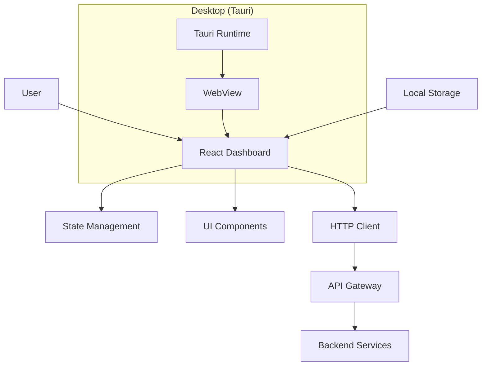

# Payment Gateway Dashboard

This directory contains the web and desktop dashboard for the payment gateway system. The dashboard provides a user-friendly interface for monitoring transactions, managing wallets, and accessing payment gateway features.

## Contents

- [Overview](#overview)
- [Features](#features)
- [Architecture](#architecture)
- [Technology Stack](#technology-stack)
- [Prerequisites](#prerequisites)
- [Getting Started](#getting-started)
- [Development Guide](#development-guide)
- [Building for Production](#building-for-production)
- [Deployment](#deployment)
- [Screenshots](#screenshots)

## Overview

The payment gateway dashboard is a modern web application built with React and Shadcn UI, designed to provide a comprehensive interface for interacting with the payment gateway backend. It offers both web and desktop versions (using Tauri) for maximum accessibility.

The dashboard enables users to:

- Monitor real-time transaction activity
- Manage digital wallets and balances
- View transaction history and analytics
- Manage payment cards
- Configure merchant settings
- Generate and manage API keys
- Access system observability dashboards

## Features

- **Real-time Transaction Monitoring** - Live updates on transaction status and activity
- **Wallet Management** - View balances, transaction history, and wallet settings
- **Payment Card Management** - Add, remove, and manage payment methods
- **Merchant Dashboard** - Configure merchant accounts and API keys
- **Analytics and Reporting** - Visual insights into transaction patterns and volumes
- **Responsive Design** - Optimized for desktop, tablet, and mobile devices
- **Desktop Application** - Native desktop experience via Tauri
- **Dark Mode Support** - Theme switching for user preference
- **Secure Authentication** - Integration with backend JWT authentication

## Architecture

The dashboard follows a client-server architecture with clear separation of concerns:



### Components

| Component | Description |
|-----------|-------------|
| **React Frontend** | Main web application built with React and TypeScript |
| **Shadcn UI** | Component library providing pre-built, accessible UI components |
| **Tailwind CSS** | Utility-first CSS framework for rapid styling |
| **Zustand** | Lightweight state management solution |
| **Axios** | HTTP client for API communication |
| **Tauri** | Framework for building desktop applications from web technologies |

### Data Flow

1. User interactions trigger actions in the React application
2. State is managed via Zustand stores
3. API calls are made through Axios to the backend API Gateway
4. Responses update the state and re-render the UI
5. Authentication tokens are stored locally for session persistence

## Technology Stack

### Frontend

| Technology | Version | Purpose |
|------------|---------|---------|
| **React** | Latest | UI framework and component architecture |
| **TypeScript** | Latest | Type-safe JavaScript development |
| **Shadcn UI** | Latest | Pre-built, customizable UI components |
| **Tailwind CSS** | Latest | Utility-first CSS framework |
| **Vite** | Latest | Build tool and development server |
| **Zustand** | Latest | State management |

### Desktop

| Technology | Purpose |
|------------|---------|
| **Tauri** | Cross-platform desktop application framework |
| **WebView** | Renders web content in native desktop window |
| **Rust Backend** | Native integration for desktop-specific features |

### Communication

| Technology | Purpose |
|------------|---------|
| **Axios** | HTTP client for API requests |
| **REST API** | Communication with backend services |
| **JWT** | Authentication token handling |

## Prerequisites

Before setting up the dashboard, ensure you have the following installed:

### For Web Development

- **Node.js**: v18 or higher
- **npm** or **yarn** or **pnpm**: Package manager
- Modern web browser with JavaScript support

### For Desktop Application (Tauri)

- **Rust**: Latest stable version
- **Cargo**: Rust package manager
- **System dependencies**:
  - Linux: `libwebkit2gtk-4.0-dev`, `build-essential`, `curl`, `file`, `libssl-dev`, `libayatana-appindicator3-dev`, ` librsvg2-dev`
  - macOS: Xcode Command Line Tools
  - Windows: Microsoft Visual Studio C++ Build Tools

### Backend Requirements

The dashboard requires a running backend instance. See the [backend/README.md](../backend/README.md) for setup instructions.

## Getting Started

### Step 1: Clone the repository

```bash
git clone https://github.com/MamangRust/example-payment-gateway-sqlx.git
cd example-payment-gateway-sqlx/dashboard
```

### Step 2: Install dependencies

```bash
npm install
# or
yarn install
# or
pnpm install
```

### Step 3: Configure environment variables

Create a `.env` file in the dashboard directory:

```env
VITE_API_BASE_URL=http://localhost:5000
VITE_API_TIMEOUT=30000
```

### Step 4: Start the development server

```bash
npm run dev
# or
yarn dev
# or
pnpm dev
```

The dashboard will be available at `http://localhost:5173`

### Step 5: Build for production

```bash
npm run build
# or
yarn build
# or
pnpm build
```

The production build will be in the `dist/` directory.

## Development Guide

### Available Scripts

| Command | Description |
|---------|-------------|
| `npm run dev` | Start development server with hot reload |
| `npm run build` | Build for production |
| `npm run preview` | Preview production build locally |
| `npm run lint` | Run ESLint to check code quality |
| `npm run format` | Format code with Prettier |

### Project Structure

```
dashboard/
├── src/
│   ├── components/      # Reusable UI components
│   ├── pages/          # Page components
│   ├── stores/         # Zustand state stores
│   ├── services/       # API service layer
│   ├── types/          # TypeScript type definitions
│   ├── utils/          # Utility functions
│   ├── hooks/          # Custom React hooks
│   ├── App.tsx         # Main application component
│   └── main.tsx        # Application entry point
├── public/             # Static assets
├── src-tauri/         # Tauri desktop application code
├── components.json    # Shadcn UI configuration
├── tailwind.config.js # Tailwind CSS configuration
├── vite.config.ts     # Vite build configuration
└── package.json       # Dependencies and scripts
```

### Adding a new component

1. Create the component file in `src/components/`:

```typescript
// src/components/MyComponent.tsx
import React from 'react';

export function MyComponent() {
  return <div>My Component</div>;
}
```

2. Use the component in any page or other component:

```typescript
import { MyComponent } from '@/components/MyComponent';
```

### Adding a new page

1. Create the page file in `src/pages/`:

```typescript
// src/pages/NewPage.tsx
import React from 'react';

export function NewPage() {
  return <div>New Page Content</div>;
}
```

2. Add routing configuration in your router setup.

### State management with Zustand

Create a store in `src/stores/`:

```typescript
// src/stores/transactionStore.ts
import { create } from 'zustand';

interface TransactionState {
  transactions: any[];
  setTransactions: (transactions: any[]) => void;
}

export const useTransactionStore = create<TransactionState>((set) => ({
  transactions: [],
  setTransactions: (transactions) => set({ transactions }),
}));
```

Use the store in components:

```typescript
import { useTransactionStore } from '@/stores/transactionStore';

function TransactionList() {
  const { transactions, setTransactions } = useTransactionStore();

  // Component logic
}
```

### API service layer

Create API services in `src/services/`:

```typescript
// src/services/api.ts
import axios from 'axios';

const api = axios.create({
  baseURL: import.meta.env.VITE_API_BASE_URL,
  timeout: 30000,
});

api.interceptors.request.use((config) => {
  const token = localStorage.getItem('token');
  if (token) {
    config.headers.Authorization = `Bearer ${token}`;
  }
  return config;
});

export default api;
```

### Styling with Tailwind CSS

Tailwind CSS utility classes are used for styling:

```typescript
<div className="flex flex-col items-center justify-center p-4 bg-white rounded-lg shadow-md">
  <h1 className="text-2xl font-bold text-gray-900">Title</h1>
</div>
```

## Building for Production

### Web Application

Build the web application for production deployment:

```bash
npm run build
```

The output will be in the `dist/` directory. Serve this directory using any static web server:

```bash
# Example with serve
npm install -g serve
serve dist -p 80
```

### Desktop Application (Tauri)

Build the desktop application for your platform:

```bash
# Build for current platform
npm run tauri build

# Build without bundling the frontend (faster for development)
npm run tauri dev
```

The built application will be in `src-tauri/target/release/bundle/`.

#### Platform-specific builds

Build for specific target platforms:

```bash
# Linux
npm run tauri build --target x86_64-unknown-linux-gnu

# macOS
npm run tauri build --target x86_64-apple-darwin
npm run tauri build --target aarch64-apple-darwin

# Windows
npm run tauri build --target x86_64-pc-windows-msvc
```

## Deployment

### Web Deployment

Deploy the web dashboard to any static hosting service:

#### Vercel

```bash
npm install -g vercel
vercel
```

#### Netlify

```bash
npm install -g netlify-cli
netlify deploy --prod --dir=dist
```

#### Nginx

Configure Nginx to serve the `dist/` directory:

```nginx
server {
    listen 80;
    server_name dashboard.example.com;

    root /var/www/dashboard/dist;
    index index.html;

    location / {
        try_files $uri $uri/ /index.html;
    }
}
```

### Desktop Application Distribution

Distribute the built desktop application:

1. Locate the installer in `src-tauri/target/release/bundle/`
2. Upload to your distribution platform (GitHub Releases, website, etc.)
3. Provide download links for each supported platform

## Screenshots

### Web Dashboard

The web interface provides a responsive, browser-based experience with full feature access.


### Desktop Application

The Tauri-based desktop application offers native window controls and system integration.


### Key Screens

The dashboard includes multiple screens for different functionalities:

- **Dashboard Overview**: High-level metrics and recent activity
- **Transactions**: Complete transaction list with filters
- **Wallet**: Balance view and transaction history
- **Cards**: Payment card management interface
- **Merchant**: Merchant settings and API key management
- **Analytics**: Visual charts and reports

## Troubleshooting

### Common Issues

**Development server not starting**

- Ensure Node.js version is 18 or higher
- Clear node_modules and reinstall: `rm -rf node_modules && npm install`
- Check if port 5173 is available

**API connection errors**

- Verify the backend is running on the configured port
- Check `VITE_API_BASE_URL` in `.env` file
- Ensure CORS is configured correctly on the backend

**Tauri build fails**

- Install the required system dependencies for your platform
- Verify Rust is correctly installed: `rustc --version`
- Check Tauri CLI version: `cargo tauri --version`

### Getting Help

- Check the [Tauri documentation](https://tauri.app/v1/guides/)
- Review [Vite documentation](https://vitejs.dev/)
- Refer to [Shadcn UI documentation](https://ui.shadcn.com/)
- Open an issue on the project repository
